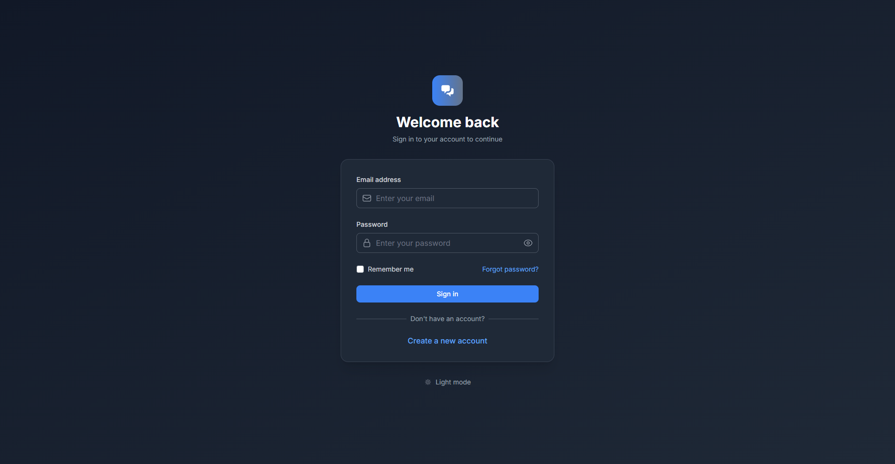

# LangGraph Chat System

A comprehensive AI-powered chat system built with modern microservices architecture, featuring LangGraph, FastAPI, and a beautiful Vue.js frontend. The system provides enterprise-grade chat capabilities with advanced AI integration, user management, and administrative controls.

## 🚀 Demo & Screenshots

### User Interface Overview

Our chat system features a modern, responsive web interface built with Vue.js and Tailwind CSS:

#### 🔐 Authentication & Login

*Secure authentication system with JWT tokens and role-based access control*

#### 📊 Dashboard

*Comprehensive dashboard with system statistics, user activity, and quick access to all features*

#### 💬 Chat Interface

*Intuitive chat interface with real-time messaging, conversation history, and AI-powered responses*

#### ⚙️ Admin Panel

*Powerful administrative interface for user management, system monitoring, and configuration*

### Live Demo

🌐 **Try the live demo**: [Coming Soon]

📖 **API Documentation**: Available at `/docs` when running locally

## ✨ Features

### 🎯 Core Features

#### **AI & Chat Capabilities**
- 🤖 **Multiple LLM Providers**: Support for OpenAI, DeepSeek, and other AI providers
- 🧠 **Enhanced Graph Architecture**: Advanced conversation flow with LangGraph
- 🔗 **REST API Tools**: AI can make external API calls during conversations
- 💾 **Conversation History**: Persistent chat sessions with context management
- ⚡ **Real-time Messaging**: WebSocket support for instant communication
- 🎛️ **Conversation Management**: Create, organize, and manage multiple chat sessions

#### **User Management & Authentication**
- 🔐 **JWT Authentication**: Secure token-based authentication system
- 👥 **Role-Based Access Control**: User and admin roles with different permissions
- 📝 **User Registration**: Self-service user registration with email validation
- 🔑 **Password Management**: Secure password change and reset functionality
- 👤 **Profile Management**: User profiles with customizable information

#### **Administrative Features**
- 📊 **System Dashboard**: Comprehensive system statistics and monitoring
- 👨‍💼 **User Management**: Admin panel for managing users and permissions
- 📈 **Analytics**: User activity tracking and system performance metrics
- ⚙️ **System Configuration**: Configurable settings and system parameters
- 🗂️ **Data Export**: Export user data and chat histories

### 🏗️ Architecture Features

#### **Microservices Architecture**
- 🔧 **Service Separation**: Dedicated services for auth, chat, admin, and frontend
- 🐳 **Docker Containerization**: Full Docker support with docker-compose
- 🌐 **API Gateway**: Nginx-based API gateway with load balancing
- 📡 **Service Communication**: RESTful APIs between services
- 🔄 **Scalable Design**: Horizontal scaling support

#### **Database & Storage**
- 🗄️ **PostgreSQL**: Robust relational database for data persistence
- 🚀 **Redis**: Caching and session management
- 📊 **Database Migrations**: Automated database schema management
- 💾 **Data Backup**: Automated backup and recovery procedures

#### **Development & Operations**
- 🔍 **Comprehensive Logging**: Structured logging with rotation policies
- 📊 **Monitoring**: Prometheus and Grafana integration
- 🧪 **Testing**: Comprehensive test suite with pytest
- 🚀 **CI/CD Ready**: GitHub Actions and deployment automation
- 📖 **Documentation**: Extensive documentation and API references

### 🎨 Frontend Features

#### **Modern UI/UX**
- 🎨 **Responsive Design**: Mobile-first responsive interface
- 🌙 **Dark/Light Mode**: Theme switching support
- ⚡ **Fast Performance**: Optimized Vue.js application with Vite
- 🎯 **Intuitive Navigation**: User-friendly interface design
- 📱 **Mobile Support**: Full mobile device compatibility

#### **Interactive Components**
- 💬 **Real-time Chat**: Live chat with typing indicators
- 🔔 **Notifications**: Toast notifications for user feedback
- 📋 **Data Tables**: Advanced tables with sorting and filtering
- 📊 **Charts & Graphs**: Visual data representation
- 🔍 **Search & Filter**: Advanced search capabilities

### 🔧 Technical Features

#### **API & Integration**
- 🌐 **RESTful APIs**: Well-documented REST endpoints
- 📡 **WebSocket Support**: Real-time bidirectional communication
- 🔌 **Webhook Support**: External system integration
- 📋 **OpenAPI/Swagger**: Auto-generated API documentation
- 🔄 **CORS Support**: Cross-origin resource sharing

#### **Security & Performance**
- 🛡️ **Security Headers**: Comprehensive security configurations
- 🚦 **Rate Limiting**: API rate limiting and abuse prevention
- ⚡ **Async Processing**: Fully asynchronous implementation
- 🗜️ **Response Compression**: Gzip compression for optimal performance
- 🔒 **Data Encryption**: Secure data handling and storage

## Project Structure

```
.
├── app/                    # Main application package
│   ├── __init__.py        # Package initialization
│   ├── main.py            # FastAPI application entry point
│   ├── config.py          # Configuration management
│   ├── api/               # API endpoints and models
│   │   ├── __init__.py
│   │   ├── models.py      # Pydantic models for requests/responses
│   │   └── routes.py      # API route definitions
│   ├── database/          # Database models and operations
│   │   ├── __init__.py
│   │   ├── models.py      # SQLAlchemy database models
│   │   └── session.py     # Database session management
│   ├── graph/             # LangGraph implementation
│   │   ├── __init__.py
│   │   ├── builder.py     # Graph construction (basic, advanced, enhanced)
│   │   └── nodes.py       # Graph node implementations
│   ├── services/          # Core services
│   │   ├── __init__.py
│   │   ├── api_tools.py   # API tools service for external calls
│   │   ├── history.py     # Conversation history service
│   │   ├── llm.py         # LLM service
│   │   └── webhook.py     # Webhook service
│   └── utils/             # Utility modules
│       ├── __init__.py
│       ├── logging.py     # Logging configuration
│       ├── monitoring.py  # Monitoring and LangSmith integration
│       └── tracking.py    # Request tracking utilities
├── docs/                  # Documentation
│   ├── api/              # API documentation
│   │   └── chat-api.md   # Chat API endpoints and models
│   ├── ai/               # AI/LangGraph documentation
│   │   ├── langgraph-architecture.md  # Graph architecture guide
│   │   ├── langsmith-integration.md   # LangSmith integration guide
│   │   └── deepseek-integration.md    # DeepSeek integration guide
│   ├── backend/          # Backend documentation
│   │   ├── architecture.md  # System architecture
│   │   └── services.md   # Services documentation
│   └── database/         # Database documentation
│       └── schema.md     # Database schema and models
├── tests/                # Test files
│   ├── test_enhanced_graph.py     # Enhanced graph tests
│   ├── test_deepseek_integration.py # DeepSeek integration tests
│   └── ...               # Other test modules organized by feature
├── requirements.txt      # Consolidated project dependencies
└── requirements-test.txt # Testing dependencies
```

## Setup

### Prerequisites

- Python 3.9+
- OpenAI API key OR DeepSeek API key (or other LLM provider)

### Installation

1. Clone the repository:
   ```bash
   git clone https://github.com/artaasd95/chat-bot-practice-langchain.git
   cd chat-bot-practice-langchain
   ```

2. Create a virtual environment:
   ```bash
   python -m venv venv
   # On Windows
   .\venv\Scripts\activate
   # On Unix/MacOS
   source venv/bin/activate
   ```

3. Install dependencies:
   ```bash
   pip install -r requirements.txt
   ```

4. Create a `.env` file in the project root with your configuration:
   ```
   # API Settings
   API_HOST=0.0.0.0
   API_PORT=8000
   API_WORKERS=4
   
   # CORS Settings
   CORS_ALLOW_ORIGINS=http://localhost:3000,http://localhost:8080
   
   # LLM Settings - Choose your provider
   LLM_PROVIDER=openai  # or "deepseek" for DeepSeek API
   LLM_MODEL=gpt-3.5-turbo  # or "deepseek-chat" for DeepSeek
   LLM_TEMPERATURE=0.7
   LLM_MAX_TOKENS=1000
   
   # OpenAI Configuration
   OPENAI_API_KEY=your_openai_api_key
   
   # DeepSeek Configuration (alternative to OpenAI)
   DEEPSEEK_API_KEY=your_deepseek_api_key
   
   # Logging Settings
   LOG_LEVEL=INFO
   LOG_RETENTION=7 days
   LOG_ROTATION=100 MB
   
   # Webhook Settings
   WEBHOOK_MAX_RETRIES=3
   WEBHOOK_RETRY_DELAY=2
   ```

### Running the Application

#### Development

```bash
uvicorn app.main:app --reload --host 0.0.0.0 --port 8000
```

#### Production

```bash
gunicorn app.main:app -k uvicorn.workers.UvicornWorker -w 4 --bind 0.0.0.0:8000
```

## API Usage

### Health Check

```bash
curl http://localhost:8000/health
```

### Enhanced Chat (Recommended)

The enhanced chat endpoint provides full conversation history and API tool calling capabilities:

```bash
curl -X POST http://localhost:8000/api/chat \
  -H "Content-Type: application/json" \
  -d '{
    "messages": [{"role": "user", "content": "Hello, how are you?"}],
    "conversation_id": "optional-session-id"
  }'
```

Response includes enhanced metadata:
```json
{
  "response": "Hello! I'm doing well, thank you for asking.",
  "request_id": "req_123456",
  "conversation_id": "conv_789",
  "metadata": {
    "api_calls_made": 0,
    "history_loaded": true,
    "messages_in_context": 5,
    "api_call_details": null
  }
}
```

### Direct Chat (Legacy)

```bash
curl -X POST http://localhost:8000/api/chat/direct \
  -H "Content-Type: application/json" \
  -d '{"messages": [{"role": "user", "content": "Hello, how are you?"}]}'
```

### Webhook Chat

```bash
curl -X POST http://localhost:8000/api/chat/webhook \
  -H "Content-Type: application/json" \
  -d '{
    "messages": [{"role": "user", "content": "Tell me about LangGraph"}],
    "callback_url": "https://your-callback-url.com/webhook"
  }'
```

### Check Webhook Status

```bash
curl http://localhost:8000/api/chat/webhook/status/{track_id}
```

## Enhanced Graph Features

### API Tool Calling

The enhanced graph can automatically detect when the LLM wants to make external API calls and execute them:

```python
# Example conversation that triggers API call
user_message = "Get the current weather in New York"
# LLM response: "API_CALL: GET https://api.weather.com/v1/current?location=New+York"
# System automatically makes the API call and incorporates the response
```

### Conversation History

Conversations are automatically saved and loaded:

- **Automatic Loading**: Previous messages are loaded when a `conversation_id` is provided
- **Context Management**: The system maintains conversation context across sessions
- **Persistent Storage**: All conversations are stored in PostgreSQL database

### Graph Types

1. **Basic Graph**: Simple linear flow for standard conversations
2. **Advanced Graph**: Extensible graph with custom nodes
3. **Conditional Graph**: Smart routing based on message content
4. **Enhanced Graph**: Full-featured graph with API tools and history management

## Extending the Graph

The system is designed to be easily extensible. To add new nodes to the graph:

1. Define new node functions in `app/graph/nodes.py`
2. Update the graph builder in `app/graph/builder.py` to include your new nodes
3. Modify the API routes as needed to support new functionality

Example of adding a new node:

```python
# In app/graph/nodes.py
async def my_new_node(state: GraphState) -> GraphState:
    # Process state
    return updated_state

# In app/graph/builder.py
async def build_custom_graph(llm: BaseLLM) -> StateGraph:
    # ... existing code ...
    graph.add_node("my_new_node", my_new_node)
    graph.add_edge("generate", "my_new_node")
    graph.add_edge("my_new_node", "postprocess")
    # ... rest of the code ...
```

## Documentation

Comprehensive documentation is available in the `docs/` directory:

- **API Documentation**: Complete API reference with examples
- **Architecture Guide**: Detailed system architecture and design patterns
- **Services Documentation**: In-depth service descriptions and implementations
- **Database Schema**: Database models and relationships
- **LangGraph Architecture**: Graph design patterns and node implementations
- **LangSmith Integration**: Comprehensive guide for tracing, monitoring, debugging, and evaluating LLM applications
- **DeepSeek Integration**: Guide for using DeepSeek models as an alternative LLM provider

## License

MIT